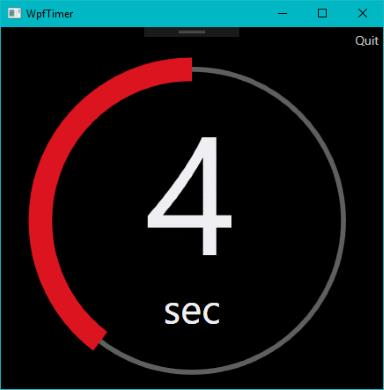
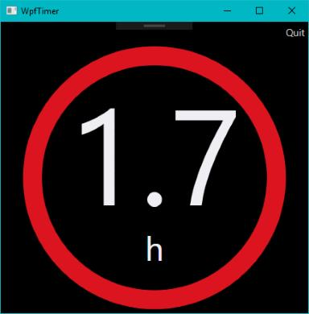

# WpfTimer
A simple timebox timer. Can be used in meetings to visualize remaining time.

## Features
- Displays remaining time as progress ring and decimal value
- Automatic display of hours, minutes, seconds
- Fullscreen or windowed
- Plays sound when timer ends (multiple available)
- Fully controllable by keyboard

### Feature ideas
- Better support for touch screens

## Usage

Command | Description
-- | --
F1 | Display keys
F2 | Edit time
F3 | Change sound
Space | Start/Resume timer
Backspace | Reset timer
ESC | Toggle fullscreen
